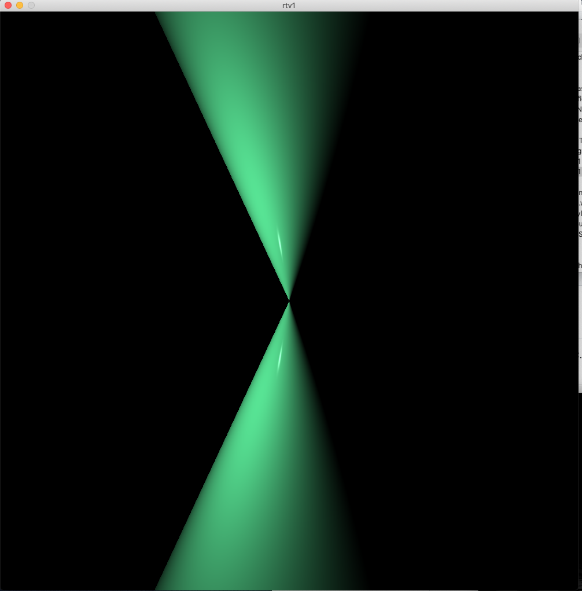
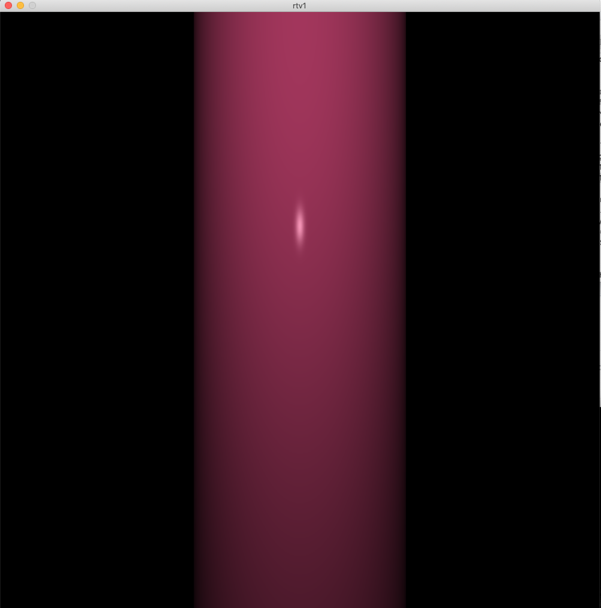
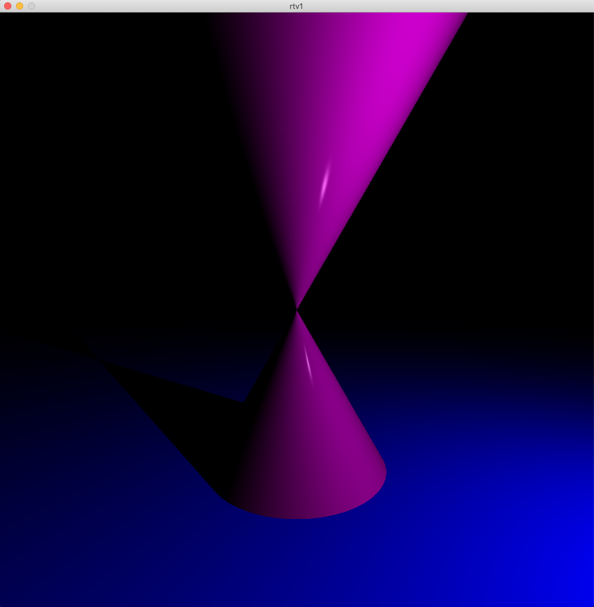
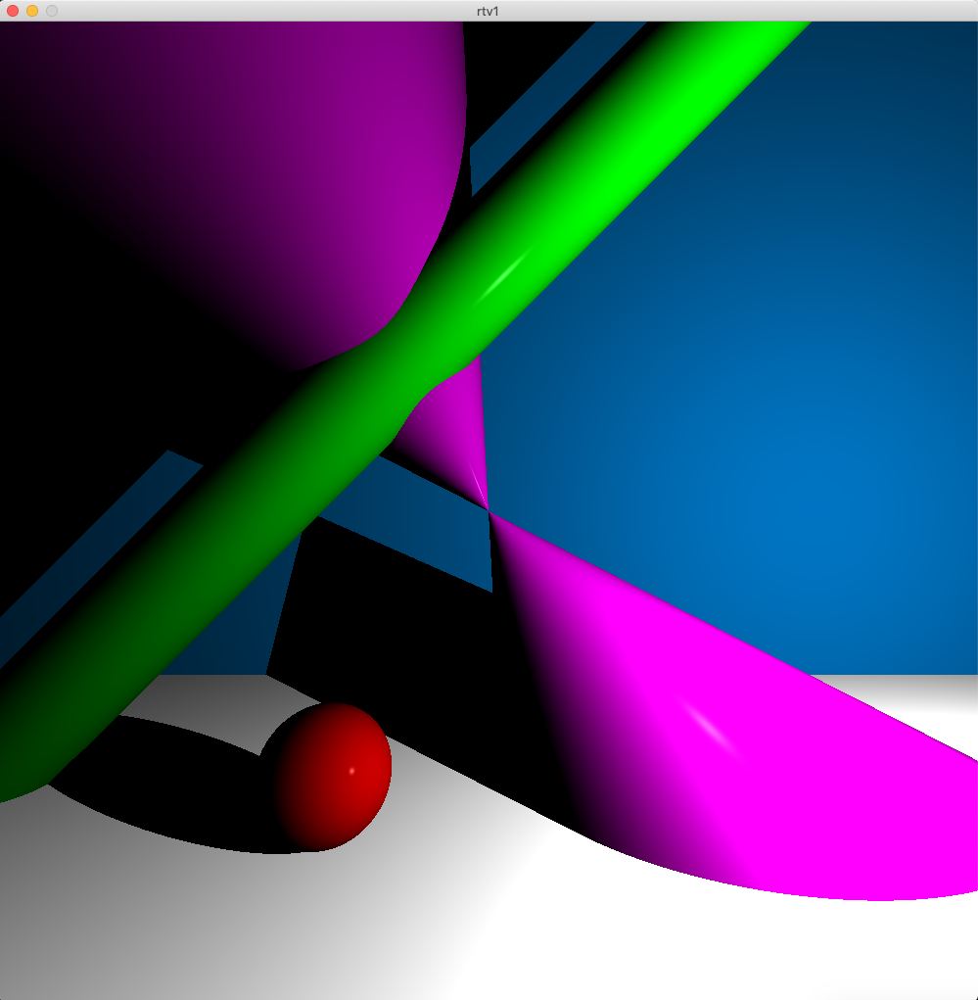
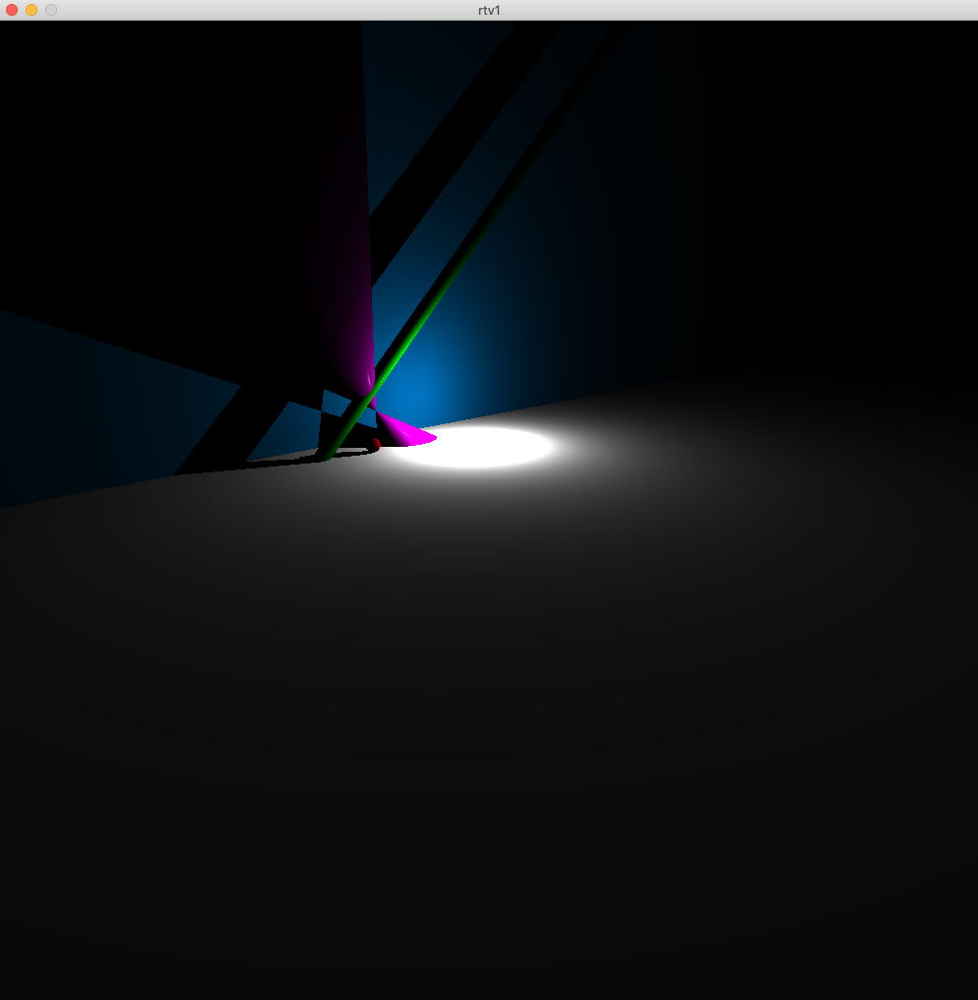
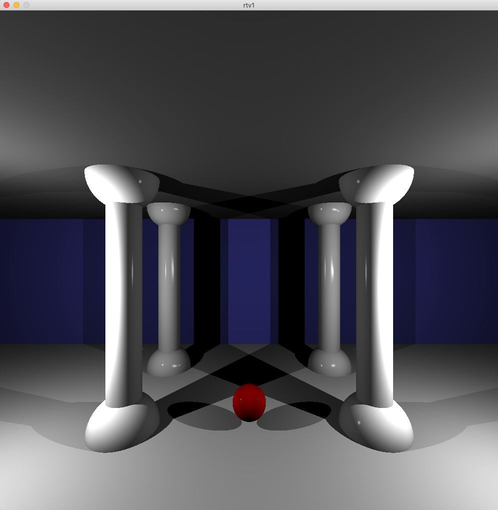
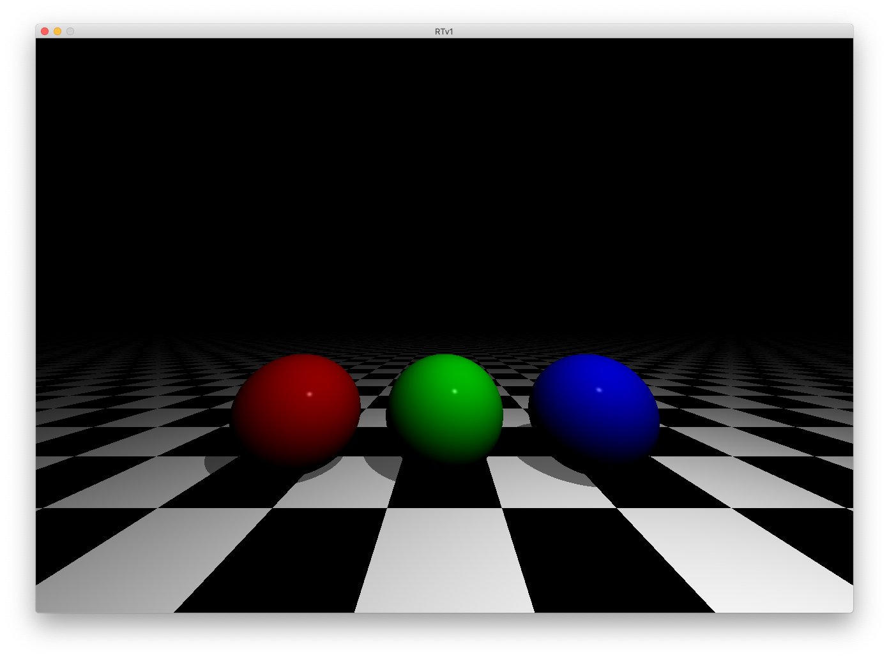
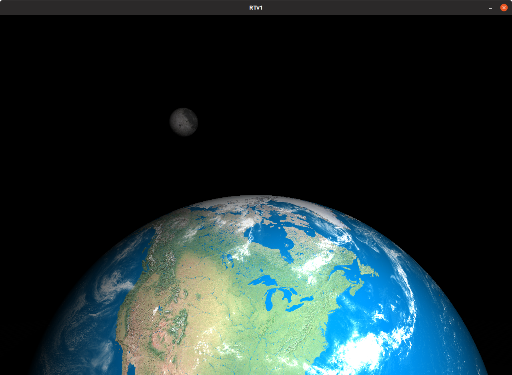

# RTv1 (MACOSX)
My first Ray Tracer in C. Third graphics project at 42.
Made with another student, my friend [lucmarti](https://github.com/TNGitUser).

To build: ```make```

Usage: ```./rtv1 scenes/file_you_want```









